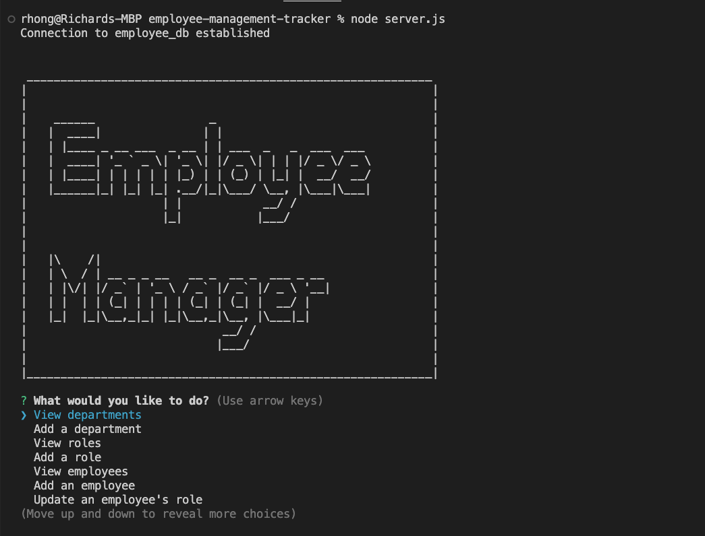

# Employee Management Tracker

[](https://opensource.org/licenses/MIT)


## Description
This app takes user input via CLI (command line interface) commands and can interact, update, add, and delete employees/roles/departments to an SQL database.

## Technologies
This app is built with [Node.js](https://nodejs.org/en/), [Inquirer](https://www.npmjs.com/package/inquirer) (version 8.2.4), [Express](https://expressjs.com/) (version 4.18.2), [mysql2](https://www.npmjs.com/package/mysql2) (version 2.2.5), and [console.table](https://www.npmjs.com/package/console.table) (version 0.10.0).

## Table of Contents
  - [Installation](#installation)
  - [Usage](#usage)
  - [Architecture](#architecture)
  - [Video Demo](#demo)
  - [Screenshot](#screenshot)
  - [License](#license)
  - [Improvements](#improvements)
  - [Questions](#questions)

## Installation

The user needs to have MySQL Server installed; instructions can vary based on the operating system. The following command can show if it is already installed:

```
mysql --version
```
After cloning the repository, the user should run the following command within the terminal:
```
npm install
```
Afterwards check towards the bottom within package.json; the user should see the following within the dependencies object:

```
...
  "dependencies": {
    "console.table": "^0.10.0",
    "express": "^4.18.2",
    "inquirer": "^8.2.4",
    "mysql2": "^2.2.5"
  }
```

## Usage
After installing Express, mysql2, inquirer, and console.table, the user should run the following commands within the terminal:
```
mysql -u root -p
```
After inserting password, the user should run the following commands while in mysql to create the database and then create mock data:
```
source db/schema.sql;
source db/seeds.sql;
exit;
```

Lastly, the user should run the following:
```
node server.js
```
After running the command, the user should expect to see something similar within his/her terminal:


## Architecture
For this program, the logic is mostly spread amongst four files: 
  * server.js on root level
    - server.js mostly serves as the main file in which inquirer asks questions internally (within server.js) and then passes the answers within the exported handleAnswers function of answerHandling.js. There are variables stored within server.js at the beginning before inquirer prompt begins in order to dynamically list options within certain questions.
  * answerHandling.js within utils
    - answerHandling.js is essentially a giant switch statement to handle a response to each of the inquirer prompts. This file passes the data needed along with imported functions from menuFunctions.js to make the database queries next.
  * menuFunctions.js within utils
    - menuFunctions.js takes the data built from server.js and answerHandling.js and makes SQL queries either through SELECT (for getting information e.g. getting department table information, getting the SUM of a department budget), INSERT for adding a new row within a table, UPDATE for the updating an employee's role functionality, and DELETE for removing a row from a table.
  * connection.js within config
    - connection.js creates a modular mysql connection to the employee_db.

## Demo
[Video demo](https://drive.google.com/file/d/166Y4ormdujSRUwjHqWO_IlmTORlYYXvy/view)

## Screenshot


## License
This app was licensed under the MIT License.

## Improvements
Creating validation for each answer to an inquirer question would be one area of improvement. 
Another improvement would be better handling of the logic for mapping the id of an answer extracted from an inquirer list question. There are several variables to help account tracking of the ids prior to extraction within server.js but I suspect that stronger understanding of mySql2 queries can alleviate or possibly eliminate the need for said variables.

## Questions
Questions, comments, concerns? Send me an email at rhong24@gmail.com.

